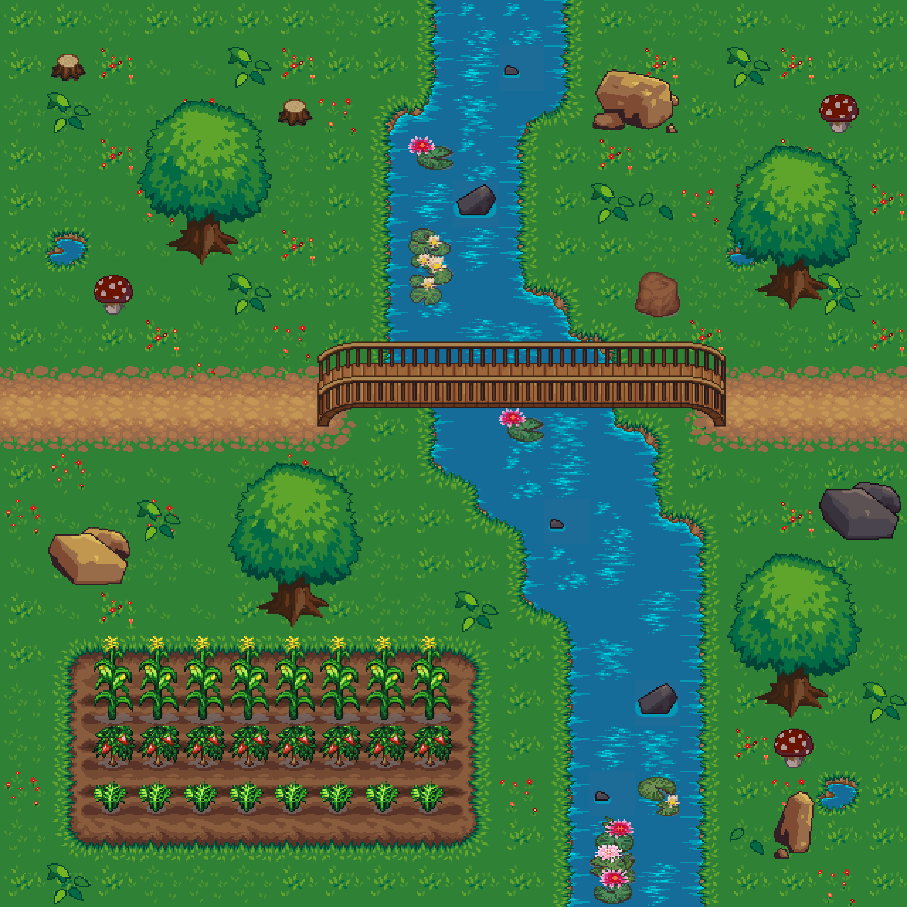
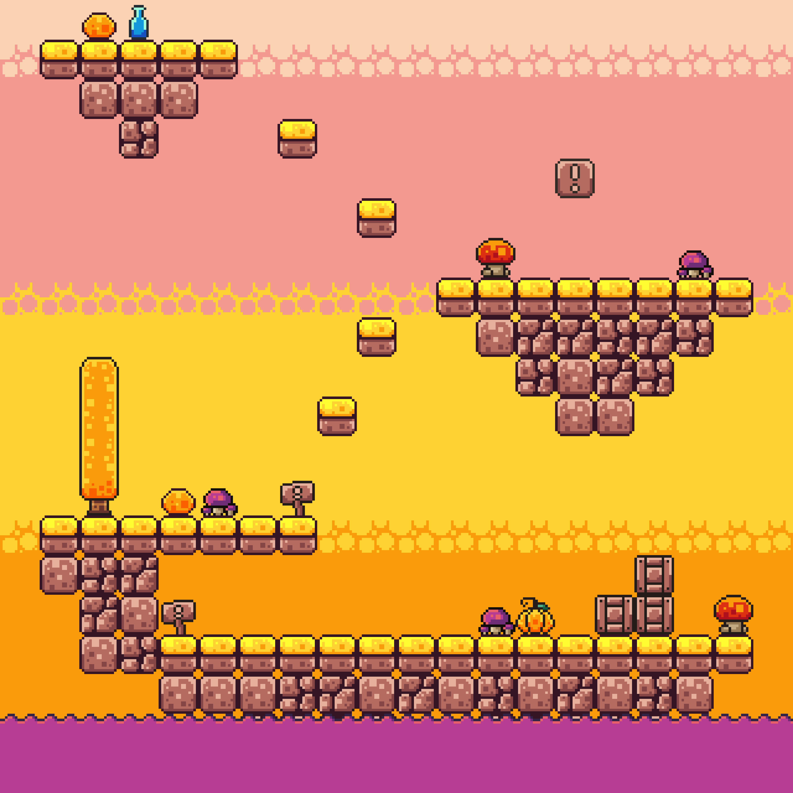

# Tiles

Tiles is a 2D map creator that allows users to upload textures and use them to build detailed 2D worlds. It features a layer-based approach, enabling users to hide, edit, and organize layers for maximum control and detail. Tiles is a powerful utility designed for developers, game designers, and artists who need an intuitive tool for crafting tile-based environments.

<div style="text-align: center;">
    
</div>

## Features

- **Layer-Based Editing** – Organize your tiles into layers that can be toggled on/off for easier editing.
- **Tile Placement Tools** – Place, erase, and fill tiles effortlessly.
- **Texture Uploading** – Import your own textures for a personalized mapping experience.
- **Project Saving & Loading** – Save your progress and continue editing later.

<div style="text-align: center;">
    
</div>

## Installation & Usage

### Prerequisites
- Windows OS
- [Visual Studio 2017 or higher](https://visualstudio.microsoft.com/)

### Setup Instructions
1. Clone the repository with all dependencies:
   ```sh
   git clone --recursive https://github.com/Resetss/Tiles.git
   ```
2. Navigate to the `Scripts` folder and run the `Setup` script.
3. Open the `.sln` file in Visual Studio 2017 or later.
4. Build and run the project from Visual Studio.


