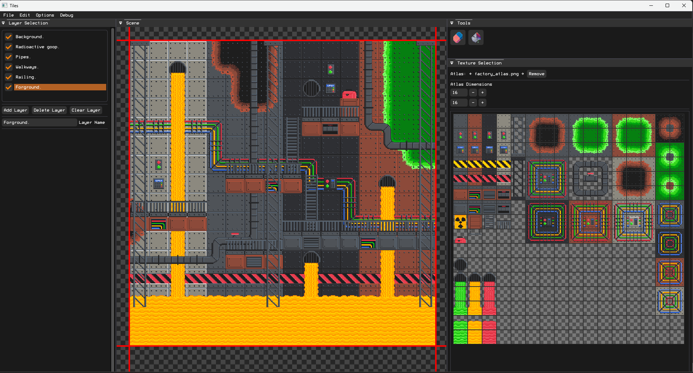
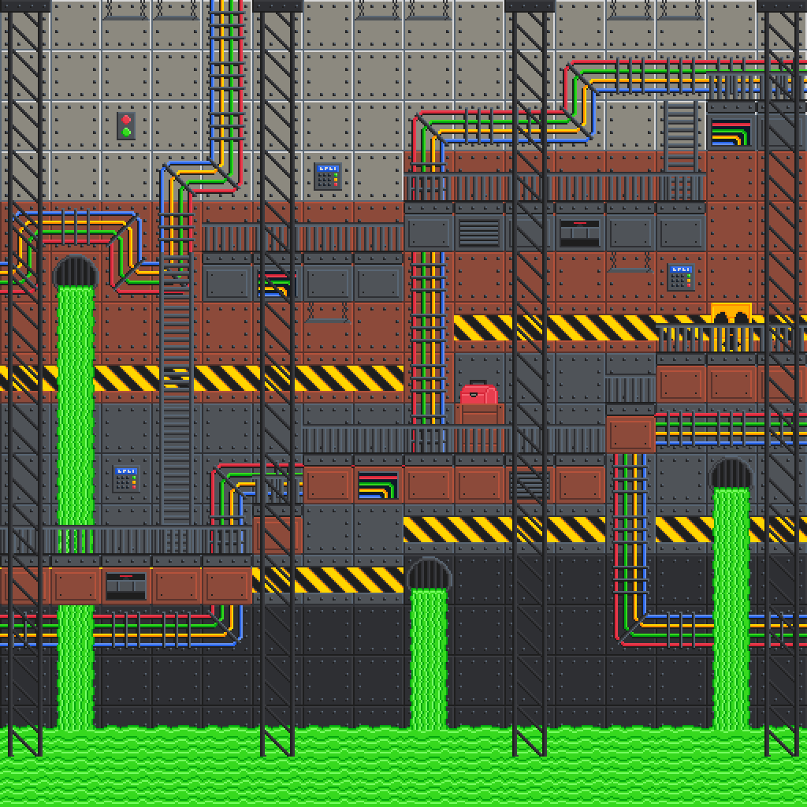
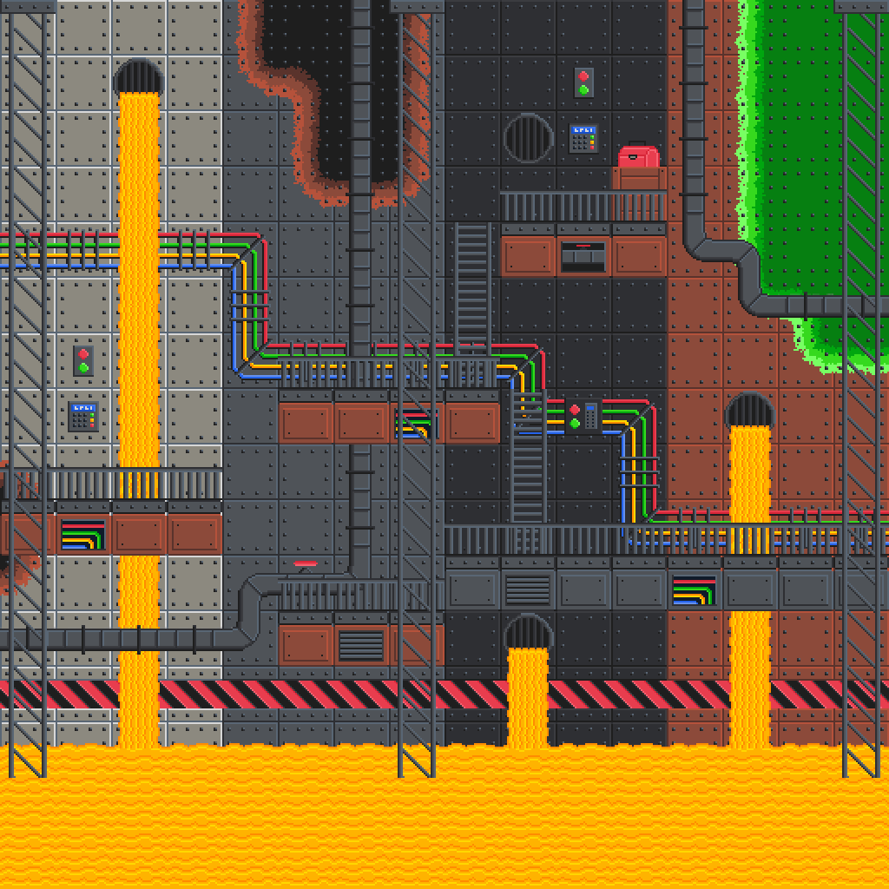
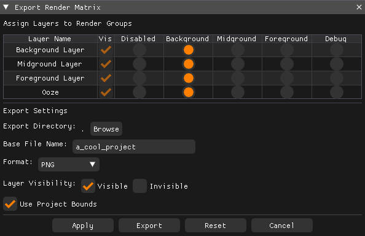

# Tiles

**Tiles** is a 2D map creator that allows users to upload texture atlases and build detailed 2D worlds. It features a **layer-based approach**, enabling users to organize, edit, and toggle textured layers for precise control. The tool includes essential features like erase and fill tools for modifying large areas efficiently. Projects can be **saved and loaded** for continued editing and exported as a **single image** or **multiple grouped layers**, depending on user needs.

<div style="text-align: center; margin-top: 20px; margin-bottom: 20px;">
    
</div>

## 🚀 Features

✅ **Layer-Based Editing** – Organize your tiles into layers that can be toggled on/off for easier editing.  
✅ **Tile Placement Tools** – Place, erase, and fill tiles effortlessly.  
✅ **Texture Uploading** – Import your own textures for a personalized mapping experience.  
✅ **Project Saving & Loading** – Save your progress and continue editing later.  
✅ **Exporting** – Export maps as PNG images with custom layer groupings.

🎨 Inspiration

Tiles was inspired by the popular framework Tiled, which provides a structured approach to tile-based map editing. The rendering framework Lumina used in this project was inspired by TheCherno's Walnut engine. The goal was to create a streamlined and intuitive tool for building 2D environments with modern rendering capabilities.

## 🔧 Technical Dependencies
Tiles is built using several key libraries:

- **[Lumina](https://github.com/Resetss/Lumina)** – A custom rendering and application framework.  
- **[ImGui](https://github.com/Resetss/imgui)** – A GUI library for in-application UI controls.  
- **[ImGuiFileDialog](https://github.com/Resetss/ImGuiFileDialog)** – A file dialog extension for ImGui, allowing easy texture selection.  
- **[GLFW](https://github.com/Resetss/glfw)** – Handles window management and input handling.  
- **[Glad](https://github.com/Resetss/glad)** – An OpenGL loader that manages API function pointers.  
- **[GLM](https://github.com/g-truc/glm)** – A C++ mathematics library optimized for graphics applications.  

## 🎨 Font

ModeSeven by Andrew Bulhak.

## 📥 Installation & Usage

### 🔧 Prerequisites
- Windows OS  
- [Visual Studio 2017 or higher](https://visualstudio.microsoft.com/)  

### 🛠️ Setup Instructions
1. Clone the repository with all dependencies:
   ```sh
   git clone --recursive https://github.com/Resetss/Tiles.git
   ```
2. Navigate to the `scripts` folder and run the `Setup` script.
3. Open the `.sln` file in Visual Studio 2017 or later.
4. Build and run the project from Visual Studio.

<div style="display: flex; justify-content: center; gap: 20px; margin-top: 20px; margin-bottom: 20px;">
    
    
</div>

## 🎨 How to Use
1. Launch the application. A default project with a 16x16 workspace will be loaded.
   - To resize, go to **File → New Project** and specify custom dimensions.
2. Select a texture atlas by clicking the **Browse** button in the **Texture Selection** panel.
   - Adjust the atlas dimensions as needed.
3. Manage layers in the **Layer Selection** panel:
   - Add, remove, clear, and rename layers.
   - Selected layers appear in an **orange box**.
   - Visible layers are marked with a **check**.
4. Choose a texture from the **Texture Selection** panel (highlighted in orange) and paint on the selected layer in the **viewport** (outlined in red).
5. Use tools like the **eraser** and **fill tool** to refine your design.
6. Export the project as a PNG:
   - **File → Export**
   - **Render Matrix**: Rows represent layers, and columns define rendering groups.
   - Each group generates a single PNG. Layers can be combined or exported separately.
   - Choose an output directory and name for exported files.
   - Groupings will be annotated with `-#`, where `#` represents the group number.
7. Save and load projects:
   - **File → Save** to store your project.
   - **File → Load** to reopen saved projects.

<div style="display: flex; justify-content: center; gap: 20px; margin-top: 20px; margin-bottom: 20px;">
    
</div>

## 🏗️ Example Projects
Two example projects are included, featuring a **factory-themed** texture atlas:
- **Examples → Factory Level 1**
- **Examples → Factory Level 2**

## ⌨️ Keyboard Shortcuts
- **CTRL + Z** – Undo  
- **CTRL + Y** – Redo  

## 🚀 Potential Future Features
- **Multi-Tile Selection** – Select and move multiple tiles at once.
- **Custom Brushes and Sizes** – Create and save reusable patterns for quicker tile placement.
- **In Editor Atlas Editing** – Ability to edit the atlas from inside the aplication.

