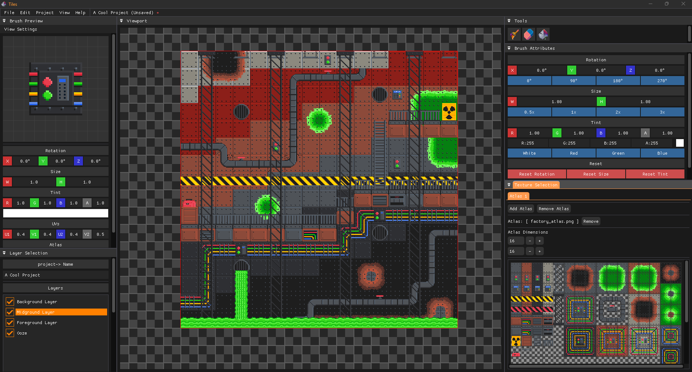
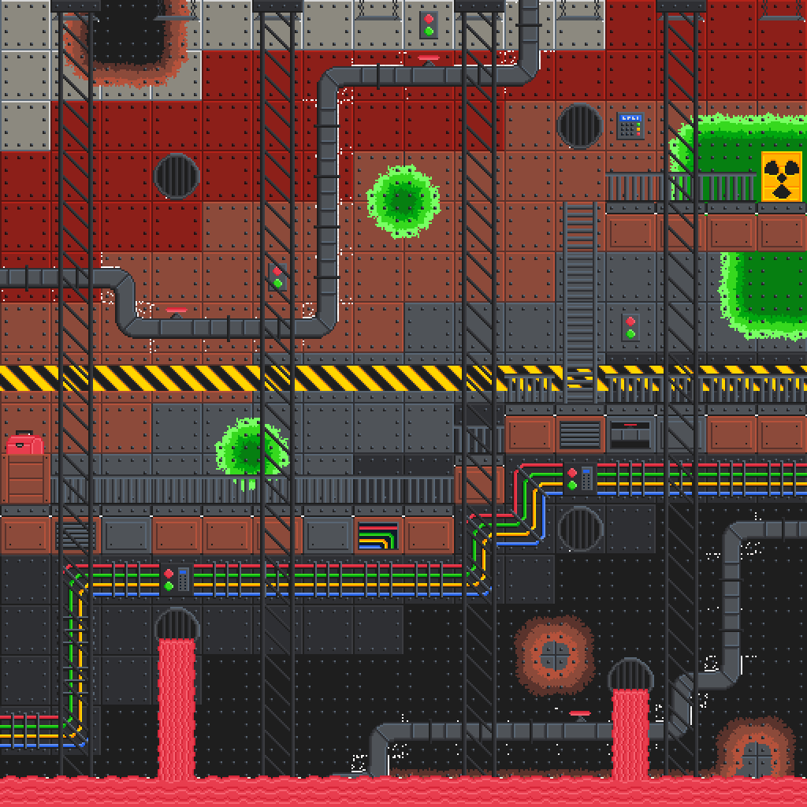
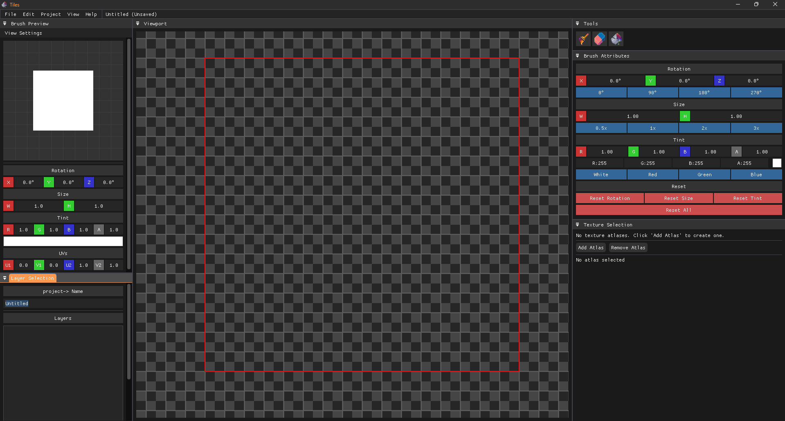
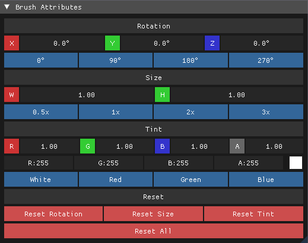
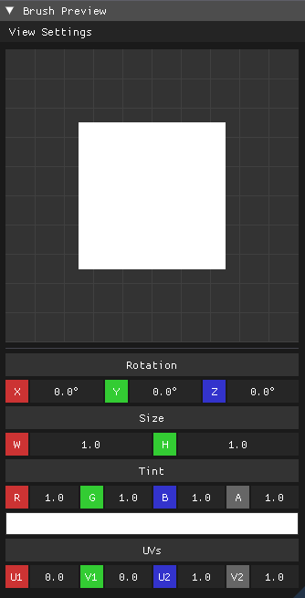
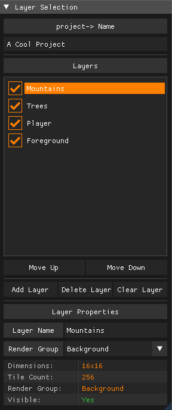
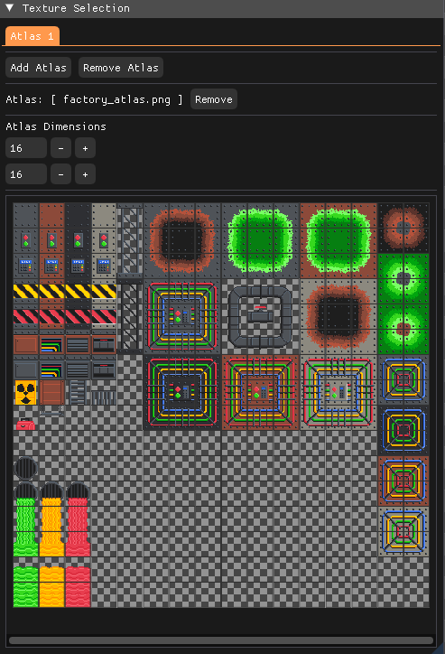
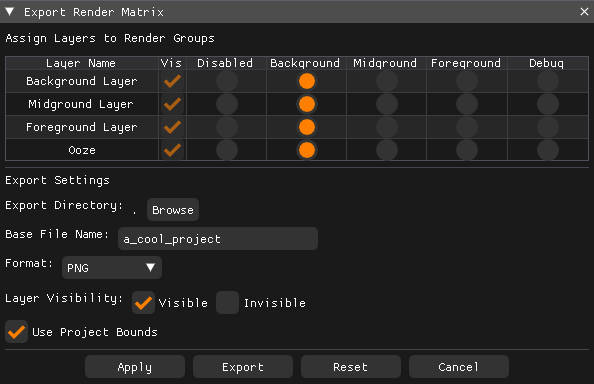

# Tiles

**Tiles** is a 2D map creator that allows users to upload texture atlases and build detailed 2D worlds. It features a **layer-based approach**, enabling users to organize, edit, and toggle textured layers for precise control. The tool includes essential features like brush customization, erase and fill tools for modifying large areas efficiently. Projects can be **saved and loaded** for continued editing and exported as a **single image** or **multiple grouped layers**, depending on user needs.

<div align="center" style="text-align: center; margin-top: 20px; margin-bottom: 20px;">
    
</div>

## Example Projects

Tiles enables the creation of complex, detailed 2D environments. Here are examples of factory-themed levels built with the included texture atlas:

<div align="center" style="display: flex; justify-content: center; gap: 10px; margin: 20px 0; flex-wrap: wrap;">
    
    
    
</div>

These examples showcase the variety of environments possible with Tiles' layer system, from sprawling industrial complexes with intricate pipe networks to multi-level platformer stages and underground facilities with diverse environmental themes.

## Features

**Layer-Based Editing** – Organize your tiles into layers that can be toggled on/off for easier editing.  
**Advanced Brush Tools** – Place, erase, and fill tiles with customizable brush attributes including rotation, size, and tint.  
**Texture Uploading** – Import your own texture atlases for a personalized mapping experience.  
**Project Saving & Loading** – Save your progress and continue editing later.  
**Flexible Exporting** – Export maps as PNG images with custom layer groupings and render matrices.

## Inspiration

Tiles was inspired by the popular framework Tiled, which provides a structured approach to tile-based map editing. The rendering framework Lumina used in this project was inspired by TheCherno's Walnut engine. The goal was to create a streamlined and intuitive tool for building 2D environments with modern rendering capabilities.

## Technical Dependencies

Tiles is built on top of **[Lumina](https://github.com/stephen-os/Lumina)** – a custom application framework featuring a state-based batch 2D renderer written in OpenGL. Lumina provides the rendering pipeline, window management, and core application structure that powers Tiles' real-time tile editing capabilities.

## Font

ModeSeven by Andrew Bulhak.

## Installation & Usage

### Prerequisites
- Windows OS  
- [Visual Studio 2017 or higher](https://visualstudio.microsoft.com/)  

### Setup Instructions
1. Clone the repository with all dependencies:
   ```sh
   git clone --recursive https://github.com/stephen-os/Tiles.git
   ```
2. Navigate to the `scripts` folder and run the `Setup` script.
3. Open the `.sln` file in Visual Studio 2017 or later.
4. Build and run the project from Visual Studio.

## Interface Overview

### Main Workspace
The central viewport displays your tile map with a grid overlay. The red outline indicates the active editing area where tiles can be placed.

<div align="center" style="display: flex; justify-content: center; gap: 20px; margin: 20px 0;">
    
</div>

### Tools Panel
Located on the right side, featuring three primary tools:
- **Brush Tool** – Place selected tiles
- **Eraser Tool** – Remove tiles from layers
- **Fill Tool** – Fill areas with selected tiles

### Brush Attributes Panel
Customize your brush with the following options:

<div align="center" style="display: flex; justify-content: center; gap: 20px; margin: 20px 0;">
    
</div>

- **Rotation** – Rotate tiles in 90-degree increments (0°, 90°, 180°, 270°)
- **Size** – Scale brush from 0.5x to 3x
- **Tint** – Apply color tinting with RGBA values and preset color options
- **Reset Options** – Quickly reset individual attributes or all at once

### Brush Preview
The left panel shows a real-time preview of your current brush settings, displaying how the selected tile will appear when placed.

<div align="center" style="display: flex; justify-content: center; gap: 20px; margin: 20px 0;">
    
</div>

### Layer Management
The Layer Selection panel allows you to:

<div align="center" style="display: flex; justify-content: center; gap: 20px; margin: 20px 0;">
    
</div>

- Create, delete, and rename layers
- Toggle layer visibility with checkboxes
- Reorder layers using Move Up/Move Down buttons
- View layer properties including dimensions and render groups
- The selected layer appears highlighted in orange

### Texture Selection
Import and manage texture atlases:

<div align="center" style="display: flex; justify-content: center; gap: 20px; margin: 20px 0;">
    
</div>

- Click "Add Atlas" to import texture files
- Adjust atlas dimensions to match your texture grid
- Select individual tiles from the atlas (highlighted in orange)
- Remove atlases when no longer needed

## How to Use

1. **Start a New Project**
   - Launch the application with a default 16x16 workspace
   - Go to **File → New Project** to specify custom dimensions

2. **Import Textures**
   - Click **Add Atlas** in the Texture Selection panel
   - Browse and select your texture atlas file
   - Adjust the atlas dimensions to match your texture grid layout

3. **Manage Layers**
   - Use the Layer Selection panel to add, remove, and organize layers
   - Selected layers appear with an orange highlight
   - Toggle visibility using the checkboxes next to layer names
   - Rename layers by editing the Layer Name field

4. **Paint Tiles**
   - Select a texture from the Texture Selection panel
   - Choose your brush tool and customize attributes (rotation, size, tint)
   - Click and drag in the viewport to place tiles on the selected layer
   - Use the eraser tool to remove tiles or the fill tool for large areas

5. **Export Your Map**
   - Go to **File → Export** to open the Export Render Matrix dialog
   - Configure layer groupings using the render matrix
   - Each column represents a separate export file
   - Choose output directory and base filename
   - Export files will be saved with group suffixes (-1, -2, etc.)

6. **Save and Load**
   - **File → Save** to store your project for later editing
   - **File → Load** to reopen saved projects
   - Projects maintain all layer information and texture references

7. **Exit**
   - **File → Exit** to close the application

## Export System

The Export Render Matrix provides flexible control over how layers are combined and exported:

<div align="center" style="display: flex; justify-content: center; gap: 20px; margin-top: 20px; margin-bottom: 20px;">
    
</div>

- **Rows** represent individual layers in your project
- **Columns** represent separate export groups
- Click dots to assign layers to specific export groups
- Multiple layers can be combined into single images
- Layers can be exported individually or grouped as needed
- Export files are named with the base filename plus group number

## Keyboard Shortcuts

### Global Shortcuts
- **CTRL + N** – New Project
- **CTRL + O** – Open Project
- **CTRL + S** – Save Project
- **CTRL + E** – Export Project
- **CTRL + Z** – Undo last action
- **CTRL + Y** – Redo last action

### Viewport Controls
- **W / A / S / D** – Move viewport up / left / down / right
- **MIDDLE MOUSE** – Hold to pan around the viewport
- **SCROLL WHEEL** – Zoom in/out within the viewport

## Future Development
- **Multi-Tile Selection** – Select and move multiple tiles simultaneously
- **Custom Brush Patterns** – Create and save reusable tile patterns
- **In-Editor Atlas Editing** – Modify texture atlases directly within the application
- **Animation Support** – Timeline-based tile animations
- **Collision Layer Support** – Dedicated layers for collision detection